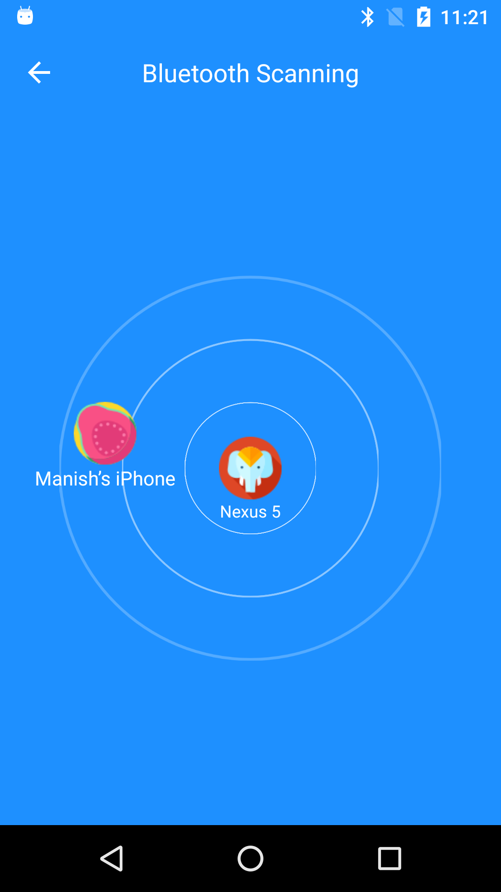

# bluetoothscanning
Scanning nearby bluetooth devices

[](https://jitpack.io/#manishkummar21/bluetoothscanning)

[]( https://android-arsenal.com/details/1/7715 )

This app helps us to find the nearby discovered device continously and it will listed.

**To do add the below code snippet anywhere from your projects in either activity or fragment and also implement listner IDetect which is callback which returns bluetooth object of selected device**


```
BluetoothConfig.with(this)
                .setBackgroundColor(Color.parseColor("#1E90FF"))
                .setPulseColor(Color.parseColor("#ffffff"))
                .setListener(this)
                .start();
```		





To get a Git project into your build:

Step 1. Add the JitPack repository to your build file

        Add it in your root build.gradle at the end of repositories:

          allprojects {
            repositories {
              ...
              maven { url 'https://jitpack.io' }
            }
          }

Step 2. Add the dependency
        
        dependencies {
	        implementation 'com.github.manishkummar21:bluetoothscanning:Tag'
	      }
	      
Step 3. Enable the databinding in your project

       ```
       dataBinding {
        enabled = true
       }
       ```
	      


